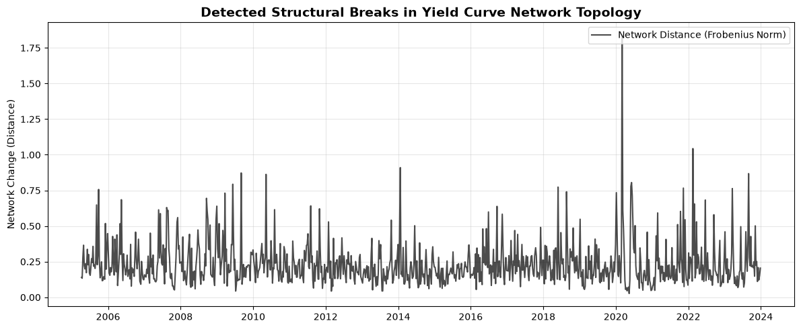
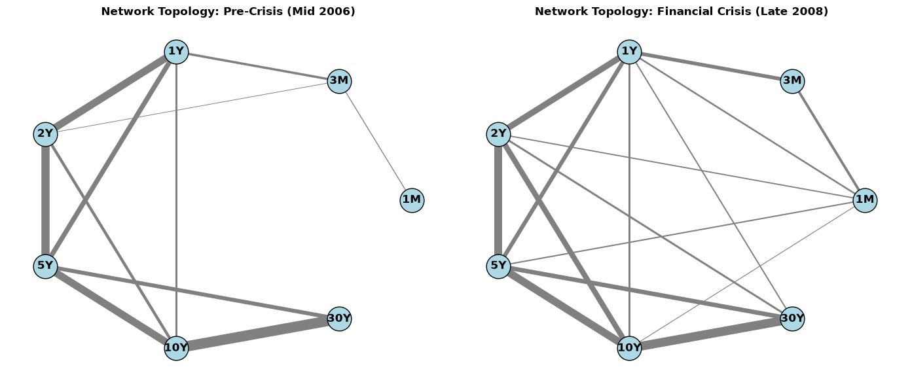

# Detecting Structural Breaks in Functional Time Series: An Application to Yield Curve Networks

### 1. Motivation
In complex scientific and economic fields, observations are frequently collected as continuous functions, such as yield curves. These functional time series exhibit non-stationarity and temporal dependence, complicating conventional statistical inference.

This project explores the dynamic conditional dependence structure of the US Treasury yield curve. By modeling different maturities as nodes in a time-varying network, the objective is to:
1. Estimate sparse precision matrices over rolling windows, rigorously controlling for false connections inherent in dependent data.
2. Detect exact structural regime shifts in the network topology using global optimization algorithms.

### 2. Methodology

#### A. Data Formulation: Economic Indicators as Curves
Let $\mathbf{y}_t = (y_{t}(\tau_1), y_{t}(\tau_2), \dots, y_{t}(\tau_p))^T$ represent the multivariate time series of yield curves at time $t$, where $\tau_i$ represents specific maturities (1-month to 30-year). Data was sourced from FRED (2005–2023). To mitigate spurious correlations driven by inherent unit roots, the series is transformed into first differences, achieving local stationarity:

$$\Delta \mathbf{y}_t = \mathbf{y}_t - \mathbf{y}_{t-1}$$

#### B. Time-Varying Network Estimation (Graphical Lasso)
To understand how maturities interact conditionally on one another, we estimate the precision matrix (inverse covariance) $\Theta_t$. Because standard estimators suffer from high false-positive edge rates in highly autocorrelated data, we apply the **Graphical Lasso** over rolling windows.

For a rolling window $W_t$, we minimize the penalized negative log-likelihood:

$$\hat{\Theta}_t = \arg\min_{\Theta \succ 0} \left( \text{tr}(S_t \Theta) - \log \det(\Theta) + \lambda \Vert{}\Theta\Vert{}_1 \right)$$

The $L_1$ penalty parameter $\lambda$ enforces sparsity, acting as a strict threshold to control for false connections and isolate true conditional dependencies.

#### C. Topological Distance (Frobenius Norm)
To quantify network evolution, we measure the topological distance between consecutive precision matrices using the Frobenius norm:

$$D_t = \Vert{}\hat{\Theta}_t - \hat{\Theta}_{t-1}\Vert{}_F$$

This isolates the structural changes in the network topology into a single univariate distance time series.

#### D. Exact Changepoint Detection (PELT + RBF Kernel)
To detect regime shifts without falling into the local-optima traps of greedy algorithms (like Binary Segmentation), we apply the **Pruned Exact Linear Time (PELT)** algorithm to the $D_t$ series.

PELT utilizes dynamic programming to find the globally optimal set of changepoints by minimizing the Bellman equation:

$$F(t) = \min_{0 \le \tau < t} \left[ F(\tau) + \text{Cost}(\tau+1, t) + \beta \right]$$

*   **Cost Function:** We utilize a non-parametric **Radial Basis Function (RBF)** kernel. Rather than simply detecting mean shifts, the RBF kernel maps the data into a higher-dimensional feature space to evaluate the empirical distribution of the network distances. Segments containing structural breaks incur massive cost penalties.
*   **Pruning:** At each time step, PELT drops candidate changepoints that violate the penalty condition $\beta$. This reduces the search space drastically, allowing for exact structural break detection in highly efficient $O(N)$ linear time.

### 3. Key Findings

The algorithm successfully isolated major macro-economic regime shifts purely from the topological shifts in the functional data, without any prior economic encoding.

Notable globally optimal structural breaks detected include:
*   **July 2009:** The regime shift signaling the end of the 2008 Great Recession.
*   **February 20, 2020:** The exact onset of the COVID-19 global market liquidity crash.
*   **January 2021:** The structural shift pricing in the subsequent global inflation cycle.

The side-by-side network topologies demonstrate how the "normal" conditional dependencies between short- and long-term maturities completely shatter and re-form during a systemic liquidity crisis.

### 4. Technologies & Reproducibility
*   **Language:** Python
*   **Core Libraries:** `scikit-learn` (Graphical Lasso), `ruptures` (PELT), `networkx`, `pandas`
*   **Execution:** The entire pipeline is contained within the Jupyter Notebook for full reproducibility. Hyperparameters for the PELT penalty $\beta$ were tuned via a programmatic grid-search loop to match historical macroeconomic priors.